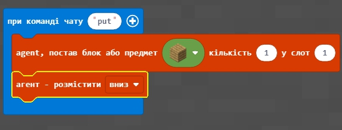
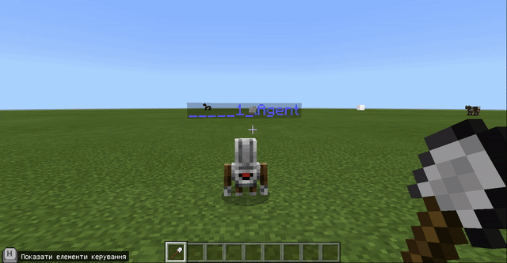
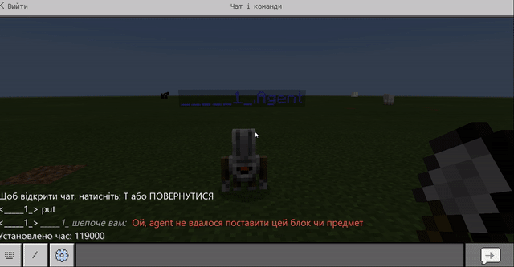
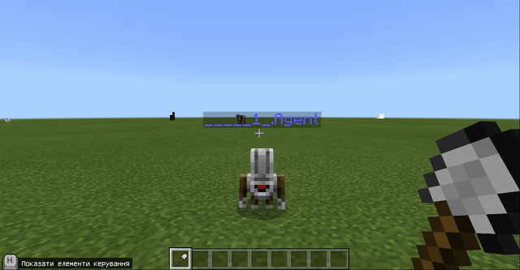

# Заняття 2. Сад
## Повторення.
<a href = "https://create.kahoot.it/share/minecraft-2/2319195d-9fee-4d6d-9516-7c368a8b89f8">Кахут на розуміння орієнтції в грі</a>
 

<a href = "https://create.kahoot.it/share/minecraft-4/ece3aef7-a443-485b-85ab-783d1ca76e20 ">Кахут. Прості команди на будівництво</a>

## Відмінність блоків від квітів.
Блоки відрізняються від квітів тим, що агент не може поставити блок в ту саму клітинку, в якій знаходиться сам.

## Поставити блок "вниз".

Додамо команду, яка підіймає агента на 1 блок вгору (над землею). 

 Тепер місце під агентом є вільним і в нього можна поставити певний блок (наприклад блок дошок).
 

 

Реализуем с помощью данной технологии квадрат из блоков. 
 

  

   

## Создадим бассейн
Для этого - возьмем ведро с водой и зальем водой созданный прямоугольник из блоков

  

  

   

## Ограждение 
Для того, чтобы в общем мире очерчивать территорию, в которой будет студент создавать свои элементы используем создание квадрата 40х40.  

