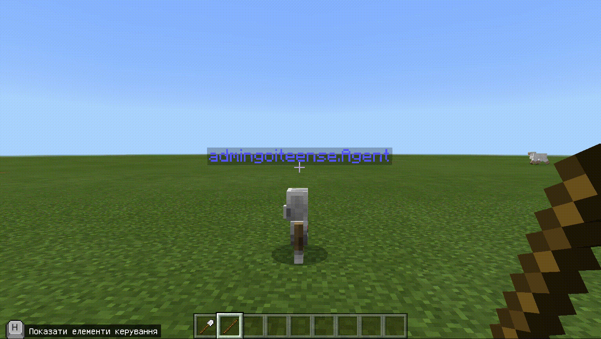

# Урок №1. Знакомство
**Цель урока:** знакомство студентов и преподавателя, ознакомление с рабочей средой и форматом обучения, изучение работы агента с помощью циклов.  
**Задачи урока:**  
а. познакомить с Преподавателем, со средой, курсом и итоговыми проектами.  
б. Познакомить с сервером, элементами управления игрока, инструментами управления агента.  
в. Сформулировать смысл обучения (учимся создавать структуры в Майнкрафт программно - это круче чем вручную).  
г. Научить агента ходить за собой (и атаковать).  
д. Научить агента создавать линию (саженец, блоки дерева, камня, т.п.).  
е. Научить агента создавать прямоугольники (контур дома). ж. Научить агента создавать объёмный прямоугольник (стены дома)  
д. Научить агента создавать прямоугольник  
**Мотивация для студента:**  
ты получишь доступ к учетной записи майнкрафта и на сервер, научишься создавать объекты у себя на компьютере и на сервере, сможешь использовать помошника-агента, который обучает как создавать объекты программно, а не "руками".  
Создание объектов программно - первый шаг к созданию игр и программированию приложений.

**План урока:**
а. Представление преподавателя (3 мин).  
б. Знакомство со всеми детьми (Имя, город, опыт программирования, почему пришли на курс). (15 мин).  
в. Заходим в Майнкрафт (2 мин).  
г. Подключаемся на сервер (5 мин).  
д. Распределяемся по миру. Показываем что умеем (строим дом, грядку). Рассказываем всем, что построили (2-3 самых активных) (10-15 мин.).  
е. Включаем блок кода (2 мин). <a href = "https://makecode.com/_d6zgMa40zRcr">Импортируем команды</a> (движение агента: вверх-вниз-вправо-влево-вперед; бегать разрушать) (3 минуты).  
ж. Строим стенку и разрушаем ее агентом. (7-10 мин.)  
з. Прописываем агенту <a href = "https://makecode.com/_fFoHgzeJPgy9">команду на строительство</a>: 1. Грядки. 2. Бордюров из дерева (ограждения).
(5-10 мин.).  
и. Даем задание сделать свою грядку с ограждением (10-15 мин.).  
к. <a href = "https://makecode.com/_YouFhhdv02j6">Показываем как построить:</a> 1. прямоугольник из цветов. 2.Прямоугольник из блоков. (15 мин)  
л. Задание: <a href = "https://makecode.com/_52Veox7q52hL">строим прямоугольник</a>-основание и на нем строим дом. Перед домом - высаживаем сад с цветами. К дому - ведет дорожка.  

## Простые действия
Заходемо в редактор коду. (Нажимаємо клавішу **с**). Обираємо блок "Новий проект".
  
Пишемо назву проекту **"Lesson 1"**  
  
Беремо пункт меню "Агент" (1). Перетягнемо блок "агент - телепортуватися до гравця".(2)  В блоку *При команді чату "run"*. Замінемо команду "**run**" на команду "**t**" (3). Запустимо (4).  

Запустимо чат (клавіша "**t**"). Введемо  команд **t**(1). Запустимо код (2).

Побачимо результат (агент телепортувався до гравця). Щоб побачити агента відійдіть назад (клавіша "**s**").

В пункті меню "Гравець"(1). *Візьмемо блок "При команді чату jump"* і переносимо їх на вільне поле (2). В блоку *При команді чату "run"*. Замінемо команду "**run**" на команду "**l**".

Зайдемо в пункт меню **"Агент"** (1), візьмемо блок "Повернутися ліворуч" та перетягнемо його до блоку "При команді чату l"(2). Запустимо код.

Відкриємо чат (клавіша **t** на клавіатурі) та введемо команду "l".

Побачемо результат - агент повернувся ліворуч
  

## Запускати дії агента при використанні предмету (використання Залізної лопати рушить агента вперед).
В Пункті меню "Гравець" беремо блок *"До предмету, що використовується"* та перетягнемо його на вільне поле.

В пункті меню "Агент" (1). Візьмемо блок "Агент - переміститися вперед by 1" та перемістимо його в синій блок *"До предмету, що використовується"* (2) та запустимо код в роботу (3)

**Візьмемо залізну лопату.** Для цього зайдемо в меню інвентар (клавіша "**e**"). Оберемо блок "мечі та лати"(1), натиснемо на пункт "Лопати" та перетягнемо *залізну лопату* в ячійку (3) та закрити блок інвентарю (4).

Для використанні лопати натисніть праву клавішу миші.

## Запускати дії агента при використанні предмету
В пункті меню "Гравець" візьміть блок "До предмет, що використовується" та поставимо його на вільне місце на робочому полі.

Змінемо предмет, що використовується (1) на палицю (2).
  
Дамо блок агенту, який він буде використовувати. Для цього переходимо в пункт меню "Агент"(1) та пролістаємо вниз (2)

Беремо блок *"agent, постав блок або предмет кількість 1 у слот 1"* та перенесемо його до синього блоку (крокодильчика) *"до предмет, що використовуєтсья"* 

Замінемо блок із травою (що за замовчуванням) (1) на блок дошок з дубової деревини..

В пункті меню "Агент" візьміть блок *"агент - розмістити вперед"* та перетягніть його до синього блоку (крокодильчику) *"до предмет (палиця), що використовується"* під блоком *"agent, постав блок або предмет кількість 1 у слот 1"* (1). Та запустіть код (2).

**Візьмемо палицю**: Зайдемо в інвентар (клавіша **e** на клавіатурі). Та додаємо до ячійки 2 палицю.

Візьмемо до рук гарвця палицю (натиснемо клавішу **2** на клавіатурі).

Використаємо палицю (права клавіша миші на клавіатурі).

В меню *"Гравець"* візьмемо блок *"до предмет, що використовуєтсья"* та переносимо його на вільне місце робочого поля.

Змінемо предмет на *дерев'яну лопату*  

Дамо блок агенту, який він буде використовувати. Для цього переходимо в пункт меню "Агент"(1) та пролістаємо вниз (2)

Беремо блок *"agent, постав блок або предмет кількість 1 у слот 1"* та перенесемо його до синього блоку (крокодильчика) *"до предмет, що використовуєтсья"* 

Замінемо блок трави (1) на білий тюльпан (2)

В меню Агент (1) беремо блок *"Агент - розмістити вперед"* та перетягуємо його в блок *"до предмет, що використовуєтсья"* (2)

В блоці *"Агент розмістити вперед"* змінюємо **вперед** на **вниз**. Та запускаємо код.
  

 Додаємо до ячійки 3 гравця дерев'яну лопату. Для цього заходимо в інвентар (клавіша **e** на клавіатурі). Заходимо в групу *"Мечі та лати"*(1) обираємо групу *"Лопати"* (2) ставимо дерев'яну лопату до ячійки 3 (3). За закриваємо вікно інвентарю (4).

Беремо в руки гравця дерев'яну лопату. Для цього нажимаємо цифру **3** на клавіатурі.

Використаємо палицю (нажмемо праву клавішу миші).

## Створення лінії квітів
Для цього в редакторі коду (клавіша **c** на клавіатурі). В меню *"Агент"* візьмемо блок *"Переміститися вперед by 1"* та перетягнемо в блок, що об'днує дії, які виконуються при використанні палиці (синій крокодильчик).  

В пункті меню *"Цикли"* візьмемо блок *"Повторити 4 рази"* (4-й зверху). Та "з'їмо" їм блоки"Розмістити вниз" та "Переміститися вперед". Та запустимо код.

Використаємо дерев'яну лопату

Отримаємо 4 білих тюльпана, посаджених в ряд.  

Змінемо білі тюльпані на помаранчеві  
  
Використаємо дерев'яну лопату знову.  Отримаємо ще 4 помаранчевих тюльпана, посаджених в ряд.  

## Збільшення кількості елементів в ряд
Замінемо цифру **4** в блоці "Повторити" на **10**.
  
Використаємо дерев'яну лопату і побачемо 10 помаранчевих тюльпанів в ряд.

## Комбінація лінії квітів та поворотів
Ви можете використовувати разом декілька інструментів для того, щоб віддавати команди агенту. Це можем бути комбінація використання предметиу та комани чату. Наприклад, для того, щоб створити квадрат з квітів ми можемо використати **дерев'яну лопату** (для того, щоб створити сторону квадрату) та команду чату **l** для того, щоб повернути ліворуч. Якщо по повторемо **4 рази**: створення лінії з 10 квітів та поврот ліворуч, то отримаємо квадрат:  

## Створення квадрату
В пункті меню *"Цикли"* візьмемо блок *"Повторити 4 рази"*. Та "з'їмо" їи існуючий цикл із 10 повторювань. 

В пункті меню *"Агент"* візьмемо блок *"Повернути ліворуч"*, та поставимо його між 2 зеленими "крокодильчиками" (повторити 4 рази та повторити 10 разів.)

Виконання такого коду будує квадарт зі стороною 11 (10+1).
